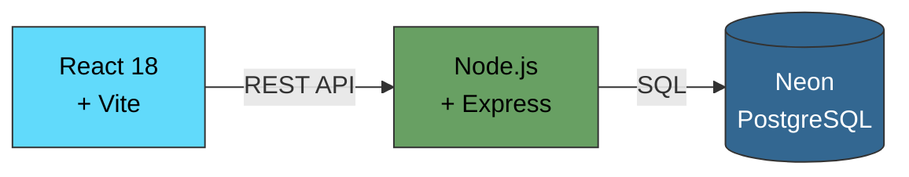
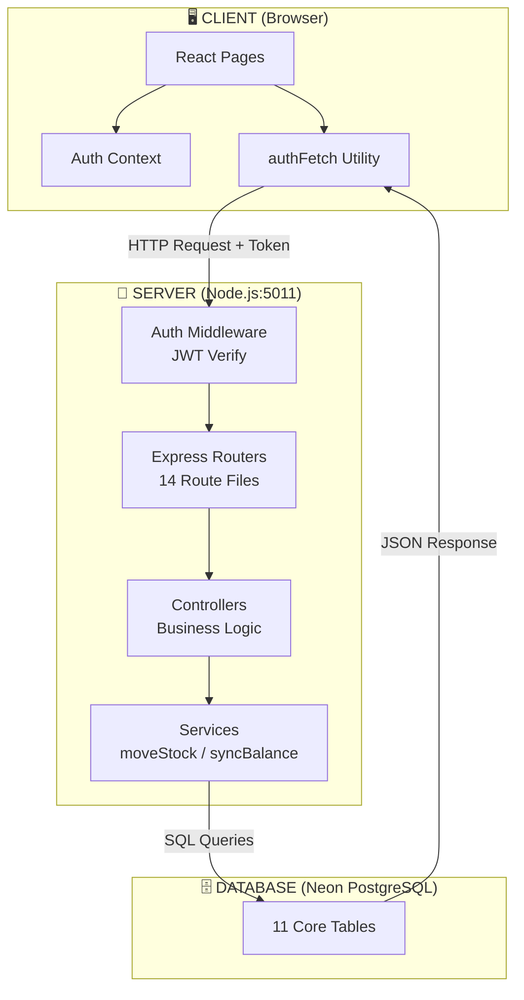
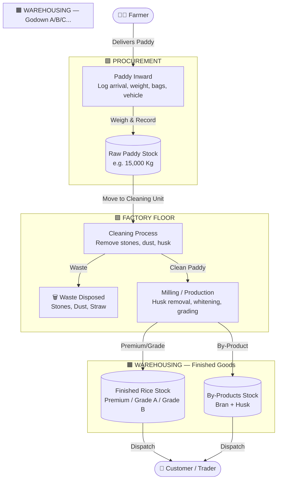
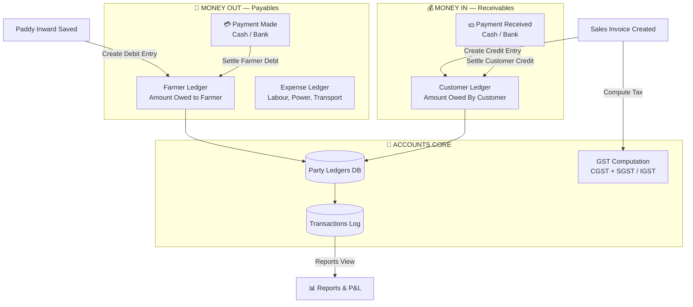
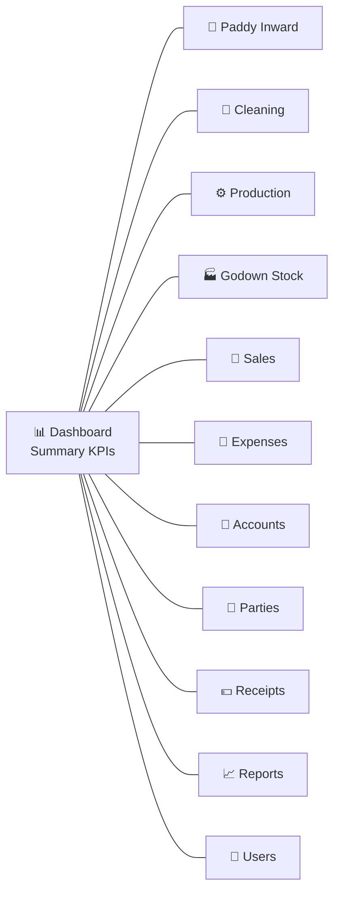
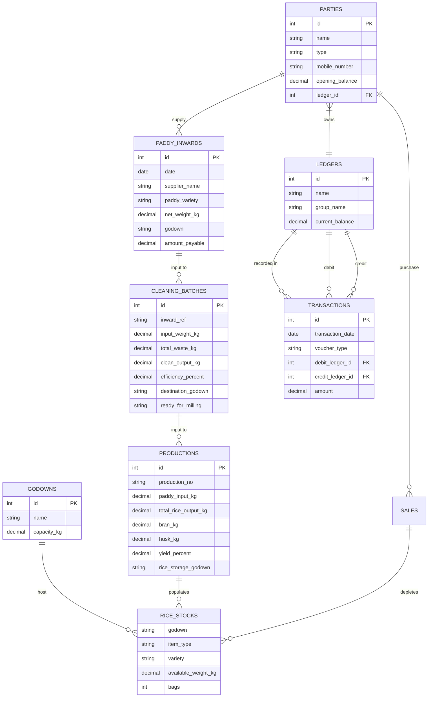
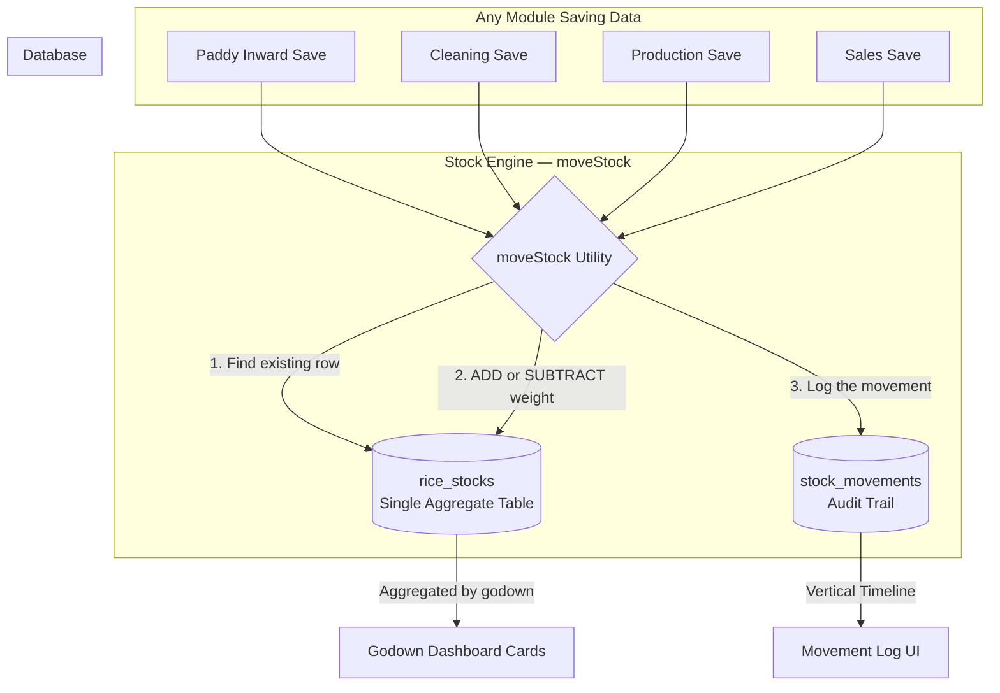
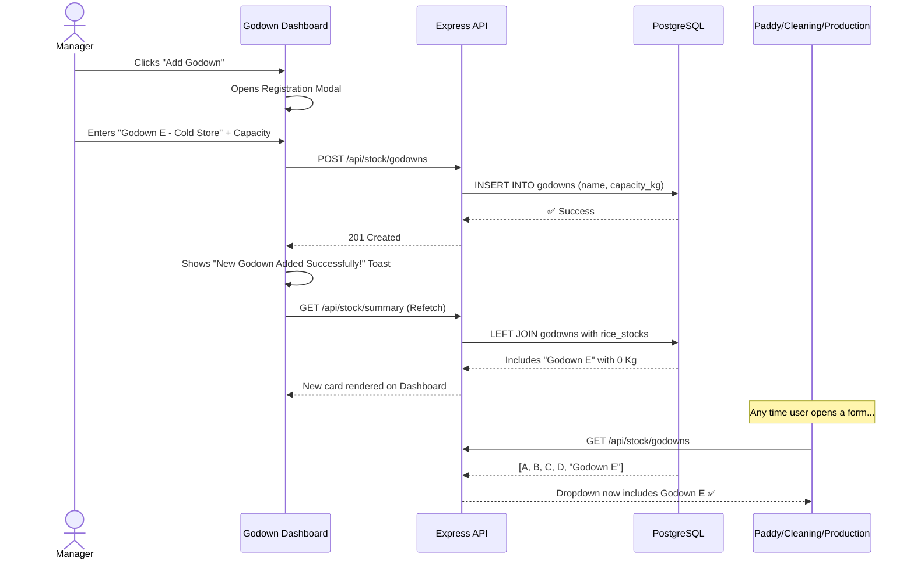
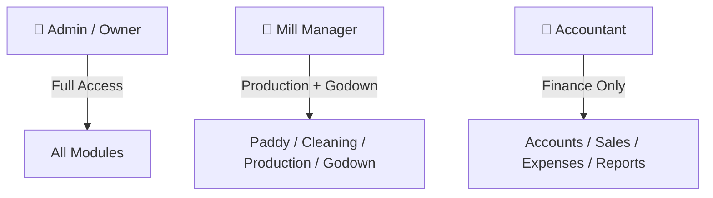

# 🌾 RiceMill Pro — Complete System Documentation
> **Version 1.0** | Last Updated: April 2026 | Maintained by: Lead Engineering Team

---

## 📋 Table of Contents

1. [Project Overview](#1-project-overview)
2. [Tech Stack](#2-tech-stack)
3. [System Architecture](#3-system-architecture)
4. [Product Flow — How Grain Moves](#4-product-flow--how-grain-moves)
5. [Money Flow — How Finance Works](#5-money-flow--how-finance-works)
6. [All Modules Explained](#6-all-modules-explained)
7. [Database Schema (ERD)](#7-database-schema-erd)
8. [API Reference](#8-api-reference)
9. [The Centralized Stock Engine](#9-the-centralized-stock-engine)
10. [Dynamic Godown Sync](#10-dynamic-godown-sync)
11. [User Roles & Access](#11-user-roles--access)
12. [Golden Rules for Developers](#12-golden-rules-for-developers)

---

## 1. Project Overview

**RiceMill Pro** is a full-stack Enterprise Resource Planning (ERP) system built specifically for a Rice Mill business. It digitalizes every physical and financial operation of the mill — from a farmer delivering raw paddy to a customer receiving an invoice for finished rice.

### 🎯 What Problems Does It Solve?
| Old Way (Manual) | New Way (ERP) |
|:---|:---|
| Paper-based stock registers | Real-time digital inventory |
| Manual cash-book / ledgers | Automated double-entry accounting |
| No production yield tracking | Per-batch milling efficiency analysis |
| Godown management by memory | Visual, searchable warehouse grid |
| GST calculations on paper | Auto-computed GST invoices |

---

## 2. Tech Stack



| Layer | Technology | Purpose |
|:---|:---|:---|
| **Frontend** | React 18 + Vite | All UI screens and user interactions |
| **Styling** | Tailwind CSS v4 | Premium dark/light hybrid design |
| **Icons** | Lucide React + HeroIcons | Visual component library |
| **HTTP Client** | `authFetch` utility | Secure, token-authenticated API calls |
| **Backend** | Node.js + Express | REST API server (Port: 5011) |
| **Database** | Neon PostgreSQL | Cloud-hosted, persistent data storage |
| **Auth** | JWT Tokens | Session management |

---

## 3. System Architecture

This diagram shows how the three layers communicate with each other.



### The Request Lifecycle (Developer View):
1. User clicks "Save" on any form.
2. `authFetch` sends a `POST` request to the backend with a **JWT token**.
3. **Auth Middleware** verifies the token. Rejects if invalid.
4. The correct **Controller** handles business validation.
5. The **Service** layer executes the atomic stock/finance update.
6. The **Database** persists the change and returns confirmation.
7. The **UI** re-fetches and shows the updated state.

---

## 4. Product Flow — How Grain Moves

This is the **physical journey** of the product through the mill.



### Key Transformations at Each Stage:

| Stage | Input | Output | Loss/Waste |
|:---|:---|:---|:---|
| **Cleaning** | Raw Paddy (100 Kg) | Clean Paddy (~90 Kg) | Stones, Dust (~10 Kg) |
| **Production** | Clean Paddy (90 Kg) | Rice + By-Products (~85 Kg) | Absolute Loss (~5 Kg) |

> [!IMPORTANT]
> **Efficiency Tracking**: The system auto-calculates `Efficiency %` at every stage. If Cleaning efficiency falls below 85%, it means either the paddy quality is bad OR something is being miscounted.

---

## 5. Money Flow — How Finance Works

This is the **financial journey** — every Rupee that moves in or out of the mill.



### Double-Entry Accounting in Action:

| Business Event | Debit (DR) | Credit (CR) |
|:---|:---|:---|
| Buy Paddy from Farmer | Paddy Stock | Farmer Ledger (Payable) |
| Pay Farmer | Farmer Ledger | Cash / Bank |
| Sell Rice to Customer | Customer Ledger (Receivable) | Sales Revenue |
| Receive Payment | Cash / Bank | Customer Ledger |
| Log Expense | Expense Account | Cash |

---

## 6. All Modules Explained

### Module Map



---

### 6.1 📊 Dashboard
- Shows top-level KPIs: Total Paddy, Total Rice, Revenue, Expenses.
- Pulls data from aggregated views across all modules.
- **Key Component**: `DashboardPage.jsx`

### 6.2 🌾 Paddy Inward
| Feature | Detail |
|:---|:---|
| Purpose | Log every arrival of raw paddy from a farmer |
| Key Fields | Supplier Name, Date, Variety, Gross/Net Weight, Vehicle No., Godown |
| Side Effect | Automatically adds weight to `rice_stocks` table |
| Financial | Creates a Debit entry in Farmer's ledger |
| File | `PaddyInwardPage.jsx` + `paddyController.js` |

### 6.3 🧹 Cleaning Process
| Feature | Detail |
|:---|:---|
| Purpose | Log the cleaning of a paddy batch + measure waste |
| Key Fields | Input Weight In, Waste Breakdown (Stones/Dust/Straw), Clean Output |
| Side Effect | Deducts from Raw Paddy stock, adds to Clean Paddy stock |
| Auto-Calc | `Efficiency % = (Clean Output / Input) × 100` |
| File | `CleaningPage.jsx` + `cleaningController.js` |

### 6.4 ⚙️ Production (Milling)
| Feature | Detail |
|:---|:---|
| Purpose | Convert clean paddy into graded rice + by-products |
| Key Fields | Rice Output (Premium/A/B/Broken), Bran + Husk Kg, Yield %, Storage Godown |
| Side Effect | Deducts Clean Paddy stock, adds Finished Rice and By-Product stocks |
| Financial | No financial entry; only stock transformation |
| File | `ProductionPage.jsx` + `productionController.js` |

### 6.5 🏭 Godown Stock (Inventory Control Center)
| Feature | Detail |
|:---|:---|
| Purpose | Real-time view of all inventory across all warehouses |
| Key Features | Summary Cards (Paddy/Rice/Bran/Husk buckets), View Details modal, Add Godown, Alerts |
| Dynamic Sync | Adding a godown here propagates to ALL module dropdowns |
| File | `GodownStockPage.jsx` + `stockRoutes.js` |

### 6.6 🛒 Sales & Invoicing
| Feature | Detail |
|:---|:---|
| Purpose | Create and manage customer invoices with GST |
| Key Fields | Customer, Product, Qty (Bags), Rate, GST %, Payment Status |
| Side Effect | Deducts from Finished Rice / By-Product stock |
| Financial | Creates Receivable in Customer Ledger |
| File | `SalesPage.jsx` + `salesController.js` |

### 6.7 💸 Expenses
- Log operational mill expenses (Labour, Power, Maintenance, Transport).
- Each expense deducts from Cash/Bank ledger.

### 6.8 📒 Accounts & Ledgers
- Full ledger view per party (Farmer / Customer).
- Balance tracking: Total Transactions → Current Balance.
- GST computation for business reporting.

### 6.9 💵 Payment Receipts
- Record incoming payments from customers.
- Settles the outstanding balance in their ledger.

### 6.10 📈 Reports
- Business-level reports: P&L, Stock Summary, By-Product statements.

### 6.11 👥 Parties Master
- Manage all Farmers (Suppliers) and Customers in one place.
- Each party has a dedicated Ledger Account auto-created.

---

## 7. Database Schema (ERD)



---

## 8. API Reference

| Method | Endpoint | Module | Description |
|:---|:---|:---|:---|
| `GET` | `/api/paddy-inwards` | Paddy | Get all paddy arrival records |
| `POST` | `/api/paddy-inwards` | Paddy | Log a new paddy arrival |
| `GET` | `/api/cleaning` | Cleaning | Get all cleaning batches |
| `POST` | `/api/cleaning` | Cleaning | Save a cleaning record |
| `GET` | `/api/production` | Production | Get all production entries |
| `POST` | `/api/production` | Production | Save a production run |
| `GET` | `/api/stock` | Stock | Get all line-item stock rows |
| `GET` | `/api/stock/summary` | Stock | Get aggregated per-godown summary |
| `GET` | `/api/stock/godowns` | Stock | Get master godown list |
| `POST` | `/api/stock/godowns` | Stock | Create a new godown |
| `GET` | `/api/sales` | Sales | Get all sales invoices |
| `POST` | `/api/sales` | Sales | Create a new sales invoice |
| `GET` | `/api/parties` | Parties | Get all parties |
| `POST` | `/api/parties` | Parties | Create a party + auto-create ledger |
| `GET` | `/api/expenses` | Expenses | Get all expenses |
| `POST` | `/api/expenses` | Expenses | Log a new expense |

---

## 9. The Centralized Stock Engine

This is the **most critical architectural decision** in the project.



> [!IMPORTANT]
> **The Golden Rule**: Every single change to physical stock — no matter which module — MUST go through the `moveStock` function. This is what ensures the dashboard always shows the right numbers.

### How `moveStock` Works:
```javascript
// Pseudocode for the Stock Engine
async function moveStock(godown, itemType, variety, weightKg, action) {
  // 1. Try to find an existing row
  const existing = await db.find({ godown, itemType, variety });

  if (existing) {
    // 2. Update: ADD (inward) or SUBTRACT (sale/use)
    await db.update({ id: existing.id, weight: existing.weight + weightKg });
  } else {
    // 3. Create a new row if it's a brand-new combination
    await db.insert({ godown, itemType, variety, weight: weightKg });
  }

  // 4. Always log the movement
  await db.insert({ stock_movements: { action, godown, weightKg } });
}
```

---

## 10. Dynamic Godown Sync

This is the **scalability feature** — how you expand the mill without touching any code.



---

## 11. User Roles & Access



| Role | Permissions |
|:---|:---|
| **Admin** | Full CRUD on all modules, User Management |
| **Manager** | Can add/view Paddy Inward, Cleaning, Production, Godown |
| **Accountant** | Can manage Sales, Expenses, Accounts, Receipts |

---

## 12. Golden Rules for Developers

> [!IMPORTANT]
> Read these before writing even one line of code.

### Rule 1 — Never Bypass the Stock Engine
❌ `UPDATE rice_stocks SET weight = weight - 100 WHERE ...` (Direct SQL)
✅ Always call the `moveStock` service function.

### Rule 2 — Godowns are Master Data
❌ Never hardcode godown names as `<option>Godown A</option>` in JSX.
✅ Always `fetch('/api/stock/godowns')` in a `useEffect` and `.map()` the result.

### Rule 3 — Always Work in Kilograms
❌ `weight: 2.5` (assuming tonnes)
✅ `weight_kg: 2500` (always store in Kg)

### Rule 4 — Double-Entry for Every Rupee
❌ Logging a sale without updating the customer ledger.
✅ Every financial event must have one DEBIT and one CREDIT entry.

### Rule 5 — Validate Before Deducting
❌ Allowing a sale of 200 Kg when only 150 Kg is in stock.
✅ Always check `available_weight_kg >= requested_weight` before committing.

---

*End of Documentation — RiceMill Pro v1.0*
