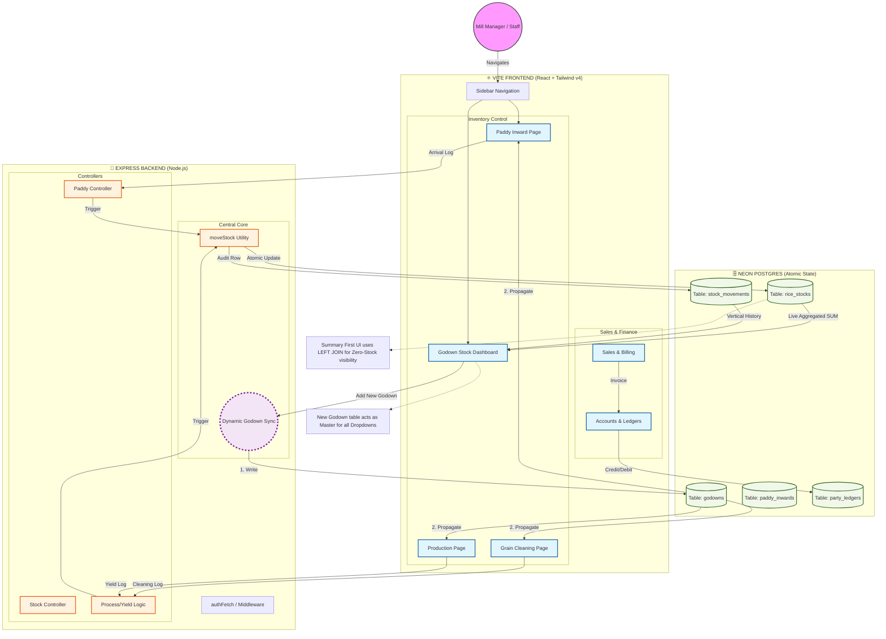

# 🛸 Rice Mill ERP: The Grand Blueprint

This unified diagram represents the entire ecosystem of your project. It maps User Actions, Frontend Logic, Backend Services, and Database Persistence in one single flow.

## 🔍 Why this Architecture is "Elite":
1.  **Atomic Inventory**: Stock shifts are not scattered. Every module calls `moveStock`, meaning your total weight always balances to zero.
2.  **Master Proxy Pattern**: The dropdowns in Paddy/Cleaning/Production are now "Live Observers" of the `godowns` table. If you delete a godown, they all know immediately.
3.  **Zero-Stock Logic**: The dashboard uses a **LEFT JOIN** from Godowns to Stocks. This means a new, empty godown room will STILL show up on your dashboard as a card, rather than disappearing.
4.  **Traceability**: Every single Kilogram is tracked in the `stock_movements` log, creating a vertical timeline of your mill's life.

---

> [!TIP]
> **Pro Choice**: For an intermediate developer, notice how the `SYNC_ENGINE` bridges the gap between Master Data (Godowns) and Operational Data (Inwards/Production). 
