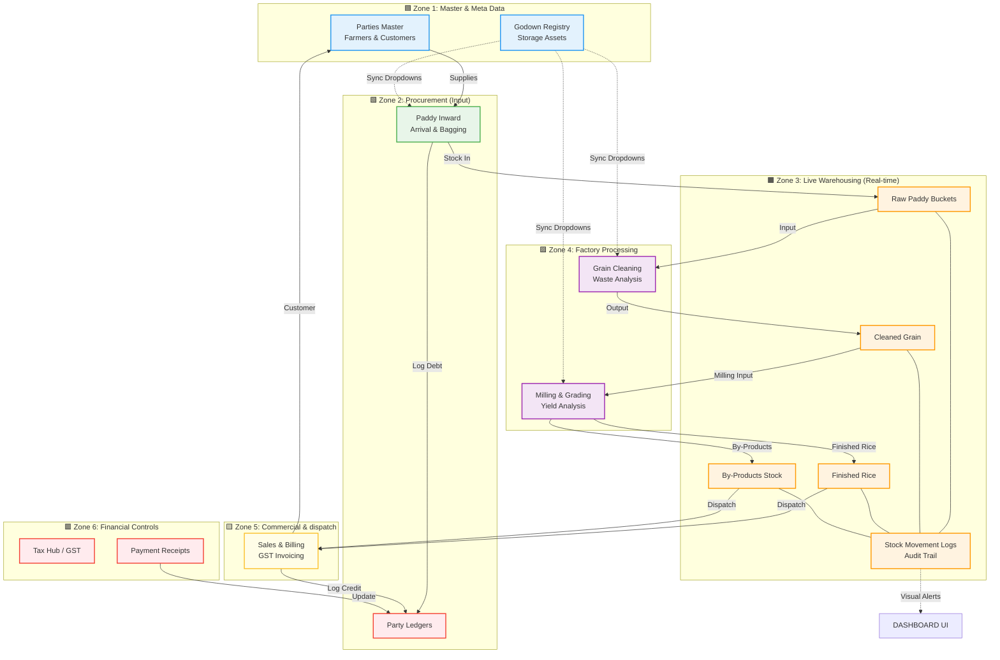

# 🗺️ Rice Mill ERP: The Ultimate Master Blueprint

This is the **Whole Project Map**. It connects every single module and database entity into one unified flow—from a Farmer bringing Paddy to a Customer receiving an Invoice.

---

## 📖 How to read this "Grand Map":

### 1. The Grain Journey (The Arcs)
Follow the **Solid Arrows** (`-->`). You'll see how material moves from a **Party** to **Inward**, gets stored in **Paddy Stock**, moves through **Processing**, and finally leaves via **Sales**.

### 2. The Financial Logic (Red Zone)
Every action in Procurement or Sales automatically triggers an update in the **Red Zone**. 
- Paddy Inward = Ledger Debit (Amount to pay farmer).
- Sales = Ledger Credit (Amount to receive from customer).
- Payment Receipt = Settles the Ledger.

### 3. The Centralized Stock (Orange Zone)
Every physical action (Input/Output) connects to the **Orange Zone**. This zone is the "Heart" of your ERP. It ensures that if you clean 100Kg Paddy, the stock in your godown decreases by exactly 100Kg.

### 4. The Master Registry (Blue Zone)
This zone controls the user experience. By updating the **Godown Registry**, you are updating the options available in every other module (Green, Purple Zones).

---

### 🚀 Key Insight for the Team:
- **PM Choice**: This blueprint shows exactly how modules are dependent. For example, you cannot do **Cleaning** if the **Paddy Inward** hasn't updated the **Stock Bucket** first.
- **Developer Choice**: This map identifies where the `moveStock` logic should be implemented (any arrow pointing TO or FROM the Orange Zone).
