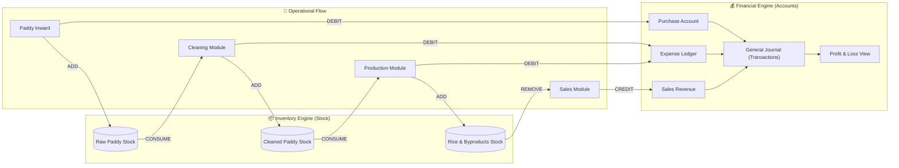

# 🕸️ RiceMill Pro: Module Inter-connectivity Map

This map details how every operational action in the Rice Mill creates a ripple effect across Inventory (Stock) and Finance (Accounts).

---

## 🗺️ The "Life of a Grain" Connectivity Diagram

---

## 📑 Module-by-Module Connectivity Breakdown

### 1. Paddy Inward Module
*   **Connected to Stock:** Increases **Raw Paddy** quantity in the godown.
*   **Connected to Accounts:** 
    *   Debits **Paddy Purchase A/C** (Direct Expense).
    *   Credits **Farmer/Vendor Ledger** (Liability).
    *   Creates a `PURCHASE` voucher.

### 2. Cleaning Module (Internal Process)
*   **Connected to Stock:** Decreases **Raw Paddy** and increases **Cleaned Paddy**.
*   **Connected to Accounts:** 
    *   Records process costs (Electricity/Labour).
    *   Debits **Process Expenses** (Direct Expense).

### 3. Production Module (Milling)
*   **Connected to Stock:** 
    *   Decreases **Cleaned Paddy**.
    *   Increases **Finished Rice** (Basmati/Raw/Sona) and **Byproducts** (Bran/Husk).
*   **Connected to Accounts:** 
    *   Syncs milling labor costs and power consumption to the **Milling Ledger**.

### 4. Sales Module
*   **Connected to Stock:** Decreases **Finished Rice** stock from selected Godowns.
*   **Connected to Accounts:** 
    *   Credits **Sales Revenue** (Direct Income).
    *   Debits **Customer Ledger** (Accounts Receivable).
    *   Credits **GST Payable** (Tax Liability).

### 5. Expense Module
*   **Connected to Accounts:** 
    *   Debits specific **Expense Category** (Indirect/Direct).
    *   Credits **Cash/Bank** account.
    *   Directly impacts the **P&L Statement**.

### 6. Accounts Module (The Hub)
*   **The Final Destination:** All modules above "talk" to this module via the `transactions` table.
*   **Outputs:** Generates the **Balance Sheet**, **GST Reports**, and **P&L Dashboard**.

---

## 💡 The "Synchronization" Rule
In RiceMill Pro, no module is an island. 
> **"If you move a bag of rice, the system moves the money. If you spend a rupee, the system records the category."**

This inter-connectivity ensures that at **5:00 PM** every day, the owner can see the exact profit without asking any manager for a manual report.
