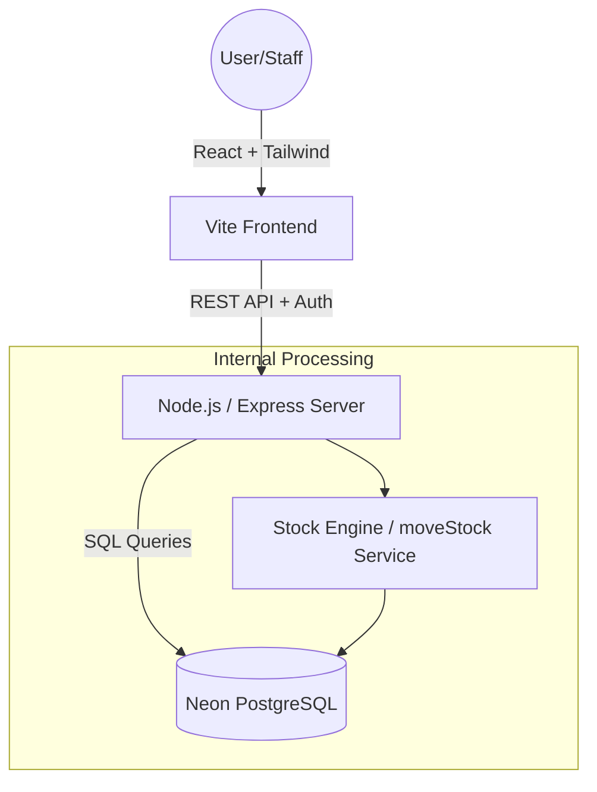
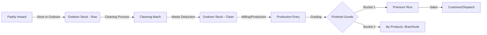
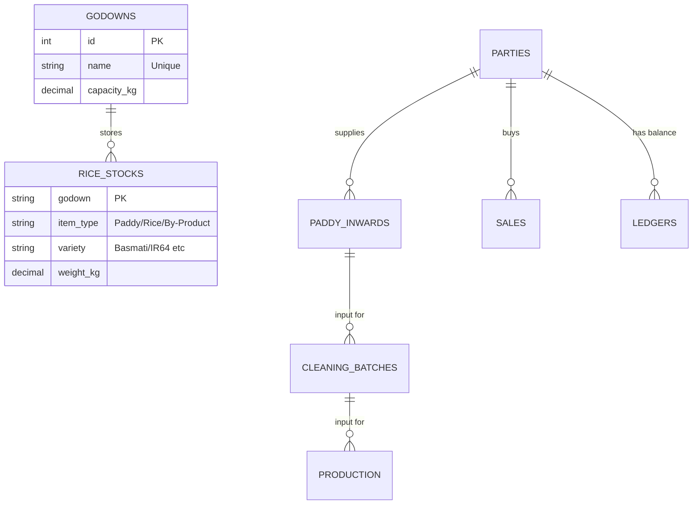

# 🏗️ Rice Mill ERP: Technical Architecture & Product Flow

This document provides a 360-degree view of the system architecture, specifically designed for Product Management (process clarity) and Intermediate Developers (schema and logic flow).

## 1. High-Level System Architecture
The project follows a standard **MERN-style** architecture (using PostgreSQL instead of Mongo) with a centralized stock engine.

---

## 2. Product Lifecycle Flow (The "Grain" Journey)
This is the core business logic. It tracks how raw material transforms into finished goods.

---

## 3. Data Relationship Diagram (ERD)
How the tables in your database are connected.

---

## 4. The Centralized Stock Engine (Developer Deep-Dive)
Instead of updating inventory in 5 different ways, the project uses a **Centralized Aggregate Pattern**.

> [!IMPORTANT]
> **Single Source of Truth**: Every transaction (Inward, Cleaning, Sale) updates the `rice_stocks` table via an atomic calculation. This prevents "Ghost Stock" (stock that doesn't exist but shows up in reports).

### How a "Move Stock" Works:
1.  **Deduct**: Subtracts weight from the source (e.g., `Godown A`).
2.  **Add**: Adds weight to the destination (e.g., `Production Unit`).
3.  **Log**: Creates a row in `stock_movements` for audit trails.
4.  **Aggregate**: The Dashboard runs a `SUM()` on this table to show you real-time cards.

---

## 5. Module Responsibilities
| Module | Product Goal | Developer Goal |
| :--- | :--- | :--- |
| **Dashboard** | Business Health Snapshot | Complex SQL Aggregations (LEFT JOINs) |
| **Paddy Inward** | Inventory on-boarding | Multi-table insert (Inward + Stock + Ledger) |
| **Cleaning** | Quality & Waste Audit | Transactional deduction (Input -> Output) |
| **Production** | Yield & Efficiency Analysis | Grading logic & By-product distribution |
| **Godown** | Logistics & Space Mgmt | Live Master Data Synchronization |

---

> [!TIP]
> **For the PM**: Focus on the **Product Lifecycle Flow**. If the "Waste Score" is high in Cleaning, it means the Paddy quality is low.
> 
> **For the Developer**: Focus on the **Centralized Stock Engine**. Never update inventory without checking the `available_weight_kg` first.
