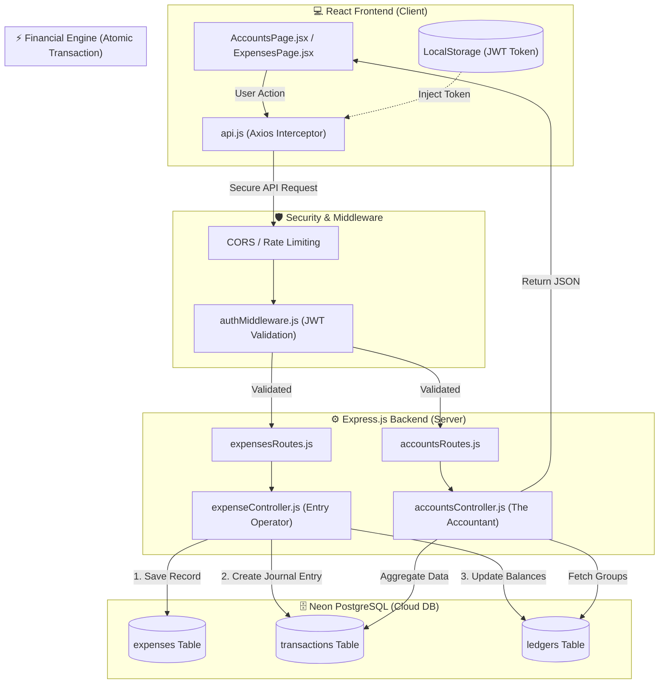

# 🏗️ RiceMill Pro: System Architecture & Data Flow

This document provides a high-level overview of the **RiceMill Pro ERP** architecture, detailing how operational actions (like expenses) are synchronized with the financial engine and the database.

## 📊 System Architecture Diagram



---

## 📂 File Structure Map

```text
RiceMill-Pro/
├── client/                     # React Application
│   ├── src/
│   │   ├── api/
│   │   │   ├── api.js         # Axios Interceptor (The Messenger)
│   │   │   └── config.js      # Backend URLs & Environment config
│   │   ├── pages/
│   │   │   ├── AccountsPage   # P&L and Balance Sheet View
│   │   │   └── ExpensesPage   # Expense Entry & Tracking
│   │   └── components/        # Shared UI (StatCards, Layouts)
│   └── .env                   # Frontend Environment Variables
│
└── server/                     # Node.js / Express Backend
    ├── server.js               # Main Entry Point (Main Gate)
    ├── src/
    │   ├── config/
    │   │   └── db.js          # Neon SQL Helper (sql.begin transaction)
    │   ├── middleware/
    │   │   └── auth.js        # Security Guard (JWT Validation)
    │   ├── controllers/
    │   │   ├── accountsController.js # The Accountant (Aggregation logic)
    │   │   └── expenseController.js  # The Entry Operator (Sync logic)
    │   └── routes/
    │       ├── accountsRoutes.js
    │       └── expensesRoutes.js
    └── .env                    # Database Credentials & Port (5011)
```

---

## 📑 File Roles & Responsibilities

| File | Role | Responsibility |
| :--- | :--- | :--- |
| **server.js** | **Project Main Gate** | Handles CORS, security headers, and mounts all API routes. |
| **auth.js** (Middleware) | **Security Guard** | Checks every request for a valid Bearer Token. Blocks unauthorized access. |
| **accountsController.js**| **The Accountant** | Performs heavy SQL calculations (`SUM`, `GROUP BY`) to create the P&L and Balance Sheet. |
| **expenseController.js** | **The Entry Operator**| Executes **Atomic Transactions**. Ensures an expense entry *must* create a Journal Entry in the transactions table. |
| **api.js** (Frontend) | **The Messenger** | Takes data from the UI, attaches the security token, and communicates with the backend. |
| **db.js** | **The Vault Handler** | Manages the connection pool to Neon PostgreSQL and provides the `sql.begin` transaction helper. |

---

## ⚡ The "Financial Engine" Workflow
When you save a **Tea Expense (₹120)**:
1. **Frontend:** `ExpensesPage.jsx` sends the data via `api.js`.
2. **Security:** `auth.js` verifies the user is an Admin.
3. **Controller:** `expenseController.js` starts an **Atomic Transaction**.
4. **Database:** 
    *   Record added to `expenses`.
    *   Ledger `Cash in Hand` balance decreased by ₹120.
    *   Ledger `Staff Welfare` balance increased by ₹120.
    *   A Journal Entry is created in `transactions` linking both.
5. **Sync:** The **P&L Dashboard** immediately reflects the ₹120 under "Indirect Expenses" by aggregating the `transactions` table.
